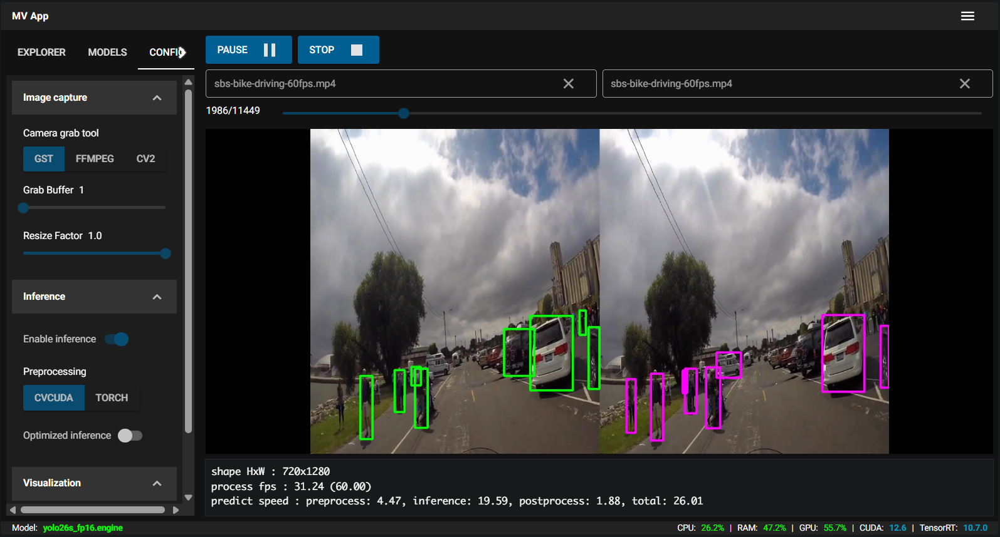

# Depth Perception and Object Detection

This project aims to detect objects and estimiate their distance to the camera. Uses side-by-side video for depth estimation and YOLO for object detection.

The following main tools are used in the development of this application:

- [NVIDIA Jetson Orin Nano](https://docs.nvidia.com/jetson/orin-nano-devkit/user-guide/latest/index.html)
- [NiceGui](https://nicegui.io)
- [TensorRT](https://docs.nvidia.com/deeplearning/tensorrt/10.x.x/_static/python-api/index.html)
- [CVCUDA](https://cvcuda.github.io/CV-CUDA/getting_started.html)
- [DeepStream GStreamer plugins](https://docs.nvidia.com/metropolis/deepstream/dev-guide/text/DS_plugin_Intro.html)
- [OpenCV](https://docs.opencv.org/4.11.0/index.html)

The application consistes of a *web UI* and a *video processing pipeline*.

## Web UI

The left panel is where input sources, vision models, and all settings are configured.

The right panel contains the viewport.

## Video Processing pipeline

The applications implements a video processing pipeline with several logical stages:

### Image Capture

This stage captures frames from a given frame source (a video or a webcam) using one of three methods:

- OpenCV
- GSstreamer 
- FFmpeg

For webcam input for binocular images, the images are synchronized by software as much as possible. 

TODO: get a hardware synchronized binocular camera

### Prediction

This stage runs object detection on a given image using TensorRT. 

The vision models used for now are YOLO26 end-to-end models exported to TensorRT engine format.

The detection process has three steps:

- **Preprocessing**: transforms the image into a tensor. Currently two image processing libraries can be selected: **cvcuda** and **pytorch**.
- **Inference**: runs the forward pass over the input tensor using the selected vision model. 
- **Postprocessing**: extracts the bounding boxes, scores, and class id from the inference output tensor back into numpy arrays.

Two implementations can be selected for this stage: 
- The normal sequential flow preprocessing -> inference -> postprocessing
    - pros: each stage speed can be easily measured, less GPU usage
    - cons: slower than the optimized approach
- An optimized flow where the preprocessing and inference are paralellized.
    - pros: faster processing of a sequence of images than the sequential approach
    - cons: speeds are harder to measure, increased GPU usage

### Logic

This stage performs all the logic required for depth perception and matching detected objects.

**Currently WIP !**

### Visualization

This stage presents the visual results on the UI. Two approaches are included here for comparison:

- **MJPEG**: Displays the processed images over a mjpeg stream. 
    This is easier to implement and the image quality is maintained, but it can be a bit slow when rendering at 60 fps.
- **WebRTC**: Displays the processed images over a WebRTC stream. 
    This is more complex to implement and the image quality varies, but the rendering is fluid at high frame rates.
